# Plano: Ambiente de Produção e Infraestrutura Ajeitai

## Contexto atual

- **Backend**: [backend/](c:\Users\iamga\projects\ajeitai\backend) — Spring Boot (parent 4.0.2 no [pom.xml](c:\Users\iamga\projects\ajeitai\backend\pom.xml)), Java 21, JPA/Flyway, Keycloak OAuth2, armazenamento em disco ([ArmazenamentoDocumentoService](c:\Users\iamga\projects\ajeitai\backend\src\main\java\com\ajeitai\backend\service\ArmazenamentoDocumentoService.java), [ArmazenamentoMidiaService](c:\Users\iamga\projects\ajeitai\backend\src\main\java\com\ajeitai\backend\service\ArmazenamentoMidiaService.java)), um [GlobalExceptionHandler](c:\Users\iamga\projects\ajeitai\backend\src\main\java\com\ajeitai\backend\infra\exception\GlobalExceptionHandler.java) básico (apenas `IllegalArgumentException`). Testes: unitários em services e integração em controllers (Testcontainers).
- **Frontend**: [frontend/](c:\Users\iamga\projects\ajeitai\frontend) — Next.js 16, PWA (@ducanh2912/next-pwa), Playwright instalado; **não há** Jest nem React Testing Library configurados no projeto; sem Dockerfile nem CI.
- **Repositório**: monorepo em `ajeitai` (frontend + backend). Não existe `.github/workflows` no repositório do projeto.

---

## 1. Backend Spring Boot — Produção, resiliência e qualidade

### 1.1 Logs estruturados (JSON)

- Adicionar dependência **logstash-logback-encoder** (ou **Logback JSON** do Spring Boot) no [pom.xml](c:\Users\iamga\projects\ajeitai\backend\pom.xml).
- Criar `src/main/resources/logback-spring.xml` com:
  - Profile `prod`: appender JSON (console) com campos: `timestamp`, `level`, `logger`, `message`, `traceId` (MDC), `exception` (apenas mensagem em prod, não stack completo no payload de log opcional).
  - Profile `dev`: console legível (pattern).
- Em **application-prod.properties**: `logging.config=classpath:logback-spring.xml`, níveis adequados (evitar TRACE em prod), e uso de **MDC** com `TraceIdFilter` ou `Observation` (Micrometer) para correlacionar requisições.

### 1.2 Tratamento de exceções e evitar 200 para erro

- **DTO de erro padronizado**: criar `ErroResponse` (ex.: `codigo`, `mensagem`, `path`, `timestamp`, `requestId`) — **sem** `stackTrace` no JSON de resposta.
- Expandir [GlobalExceptionHandler](c:\Users\iamga\projects\ajeitai\backend\src\main\java\com\ajeitai\backend\infra\exception\GlobalExceptionHandler.java):
  - `MethodArgumentNotValidException` → 400 + lista de erros de validação.
  - `AccessDeniedException` → 403.
  - `IllegalArgumentException` (já existe): manter 404 quando “não encontrado”, 400 caso contrário.
  - `Exception` genérica → 500, mensagem genérica (“Erro interno”), logar stack trace **apenas no servidor** (nunca no body da resposta).
- Garantir que **nenhum** controller retorne 200 com corpo de erro: revisar lugares que fazem `ResponseEntity.badRequest().build()` ou retornam erro no body com 200; padronizar em `@RestControllerAdvice` e respostas sempre com status HTTP coerente (4xx/5xx).

### 1.3 Configuração resiliente (application-prod.properties)

- **DataSource**: HikariCP com `maximum-pool-size` adequado (ex.: 20–50), `connection-timeout`, `idle-timeout`, `max-lifetime`; `spring.jpa.open-in-view=false` (já está).
- **Tomcat**: `server.tomcat.threads.max`, `server.tomcat.max-connections`, `server.tomcat.accept-count` para suportar fila e ~500 requisições simultâneas.
- **Timeout**: `spring.mvc.async.request-timeout` se houver chamadas assíncronas.
- **Health**: ativar `management.endpoints.web.exposure.include=health,info` e `management.health.*` para DB e, depois, Redis.

### 1.4 Performance ~500 requisições simultâneas, rate limit, idempotência, cache

- **Redis**:
  - Dependência `spring-boot-starter-data-redis`; config em **application-prod** (host, port, password, pool).
  - Cache: `@EnableCaching`; cachear leituras pesadas (ex.: catálogo, listagem prestadores, detalhe prestador) com TTL definido; usar `CacheManager` com Redis.
- **Rate limiting (anti-DDoS)**:
  - Opção A: **Bucket4j** com backend Redis (por IP ou por usuário).
  - Opção B: **Resilience4j** RateLimiter com Redis.
  - Filtro ou interceptor que rejeita com **429** quando limite excedido; configurável por profile (ex.: desligado em dev).
- **Idempotência**:
  - Header opcional `Idempotency-Key` em POST/PUT.
  - Filtro/interceptor: se presente, verificar em Redis (chave = header); se já processado, retornar resposta em cache com **200** (ou 201); se em processamento, **409** ou retry-after; caso contrário, processar e guardar resultado em Redis com TTL (ex.: 24h).
- **Resiliência**: Resilience4j para **circuit breaker** em chamadas externas (AbacatePay, Keycloak se necessário); retry com backoff para falhas transitórias.

### 1.5 Object Storage (Magalu Cloud — S3-compatível ou API nativa)

- A documentação pública do Magalu Cloud descreve Object Storage via CLI `mgc`; **compatibilidade S3** não está explícita. Duas abordagens:
  - **Abordagem recomendada**: definir interface **StorageService** (ex.: `salvar(path, InputStream, contentType)`, `excluir(path)`, `obterUrl(path)` ou `obterInputStream(path)`). Implementações:

    1. **LocalStorageService**: usa o filesystem atual (baseado em `ArmazenamentoDocumentoService` / `ArmazenamentoMidiaService`), ativo em dev.
    2. **S3CompatibleStorageService**: usa AWS SDK v2 (S3 client) com **endpoint configurável** e path style; em produção, configurar endpoint e credenciais do Magalu Cloud **se** eles oferecerem endpoint S3-compatível (confirmar com suporte/docs).

  - Se Magalu **não** for S3-compatível: implementar **MagaluNativeStorageService** usando a API REST deles (documentação mgc/API) e manter a mesma interface.
- **Buckets**: dois buckets (ou prefixos): um para **avatars** (perfil cliente/prestador), outro para **documentos de identificação** (prestador). Config via properties: `app.storage.type=local|s3|magalu`, `app.storage.bucket-avatars`, `app.storage.bucket-documents`, endpoint e credenciais.
- Refatorar [ArmazenamentoDocumentoService](c:\Users\iamga\projects\ajeitai\backend\src\main\java\com\ajeitai\backend\service\ArmazenamentoDocumentoService.java) e [ArmazenamentoMidiaService](c:\Users\iamga\projects\ajeitai\backend\src\main\java\com\ajeitai\backend\service\ArmazenamentoMidiaService.java) para delegar a essa interface (ou manter um facade que escolhe o bean por profile).

### 1.6 Testes backend — meta 70% de cobertura

- **JaCoCo**: plugin no [pom.xml](c:\Users\iamga\projects\ajeitai\backend\pom.xml) com `prepare-agent` e report; falhar build se cobertura &lt; 70% (regras para linhas e branches).
- **Unitários**: cobrir services ainda sem teste (ex.: `CatalogoService`, `PortfolioService`, `ArmazenamentoDocumentoService`/Midia ou novo StorageService), exceções e edge cases nos já existentes.
- **Integração**: manter e ampliar testes de controller com Testcontainers (Postgres, Redis opcional); cobrir novos endpoints e cenários de erro (400, 403, 404, 429, 500).
- **E2E**: ampliar [CatalogoE2ETest](c:\Users\iamga\projects\ajeitai\backend\src\test\java\com\ajeitai\backend\e2e\CatalogoE2ETest.java) e adicionar fluxos críticos (login, agendamento, upload).

---

## 2. Docker

### 2.1 Backend

- **Dockerfile** multi-stage em `backend/`:
  - Stage 1: Maven com `pom.xml` — `mvn -DskipTests package` (ou com testes se desejar no CI).
  - Stage 2: imagem base `eclipse-temurin:21-jre-alpine` (ou distroless); copiar jar do stage 1; user non-root; `ENTRYPOINT ["java", "-jar", "app.jar"] `com JVM options para produção (heap, GC, talvez `-Dspring.profiles.active=prod` sobrescrito por env).
- **.dockerignore**: `target/`, `.mvn/wrapper`, arquivos de IDE, `*.md`.

### 2.2 Frontend

- **Dockerfile** multi-stage em `frontend/`:
  - Stage 1: `node:20-alpine` — `npm ci`, `npm run build`.
  - Stage 2: `node:20-alpine` ou `nginx:alpine` — copiar `.next`, `static`, `node_modules` (ou standalone output do Next) e `package.json`; se Node: `npm start`; se nginx: config para servir estáticos e proxy para Node em modo standalone (conforme [next.config](c:\Users\iamga\projects\ajeitai\frontend\next.config.ts)).
- Para **Vercel**: o deploy normalmente usa o build da Vercel; o Dockerfile serve para rodar a PWA em outros ambientes (ex.: preview ou fallback).

---

## 3. GitHub Actions — CI/CD

- **Repositório**: assumir raiz do monorepo `ajeitai` (pasta que contém `frontend/` e `backend/`). Workflows em `.github/workflows/`.

### 3.1 Frontend (PWA — Vercel)

- **Workflow** (ex.: `deploy-frontend.yml`):
  - Trigger: `push` na `main` (e opcionalmente `pull_request` para preview).
  - Jobs: checkout; setup Node; `npm ci`; `npm run lint`; `npm run test` (após configurar Jest); `npm run build`.
  - Deploy Vercel: usar **Vercel GitHub Integration** (conectar repo e pasta `frontend`) **ou** `vercel --prod` com token em secrets (`VERCEL_TOKEN`, `VERCEL_ORG_ID`, `VERCEL_PROJECT_ID`).
  - Variáveis de ambiente: `NEXT_PUBLIC_API_URL` para a URL do backend em produção (definir na Vercel ou no workflow).

### 3.2 Backend (Magalu Cloud — VM)

- **Workflow** (ex.: `deploy-backend.yml`):
  - Trigger: `push` na `main` (caminhos: `backend/**`).
  - Jobs: checkout; setup Java 21; cache Maven; `mvn -B verify` (inclui testes e JaCoCo); build da imagem Docker (usando Dockerfile do backend); push para registry (Magalu Cloud Registry ou outro).
  - Deploy na VM: SSH na VM Magalu (secret `SSH_PRIVATE_KEY`, host e user) e executar: pull da imagem, parar container antigo, subir novo container com env (DB, Redis, Keycloak URL, Object Storage, etc.) — ou usar script de deploy (docker-compose na VM).
  - **Secrets**: `MAGALU_REGISTRY_*`, `SSH_*`, `DB_URL`, `REDIS_URL`, `KEYCLOAK_ISSUER_URI`, credenciais Object Storage, etc.

### 3.3 Integração Object Storage (Magalu) no deploy

- No deploy do backend (VM ou K8s), injetar variáveis do Object Storage Magalu (endpoint, bucket names, API key ou access/secret se S3-compat). Se Magalu usar apenas CLI `mgc`: automatizar criação de buckets/API key via script no pipeline ou Terraform/Ansible; aplicação consome endpoint e credenciais via env.

---

## 4. Infraestrutura Magalu Cloud

- **VM**: para rodar backend (Docker), Redis (container ou instalado), e eventualmente o chat (Go). Alternativa: Kubernetes (se preferir orquestração).
- **Banco de dados**: cluster PostgreSQL gerenciado (Magalu) ou Postgres em container na VM; migrações Flyway no startup do backend.
- **Redis**: instância gerenciada ou container na mesma VM; usado para cache, rate limit e idempotência.
- **Object Storage**: dois buckets (ou prefixos): avatares e documentos; integração conforme seção 1.5.
- **Rede**: backend exposto via load balancer ou IP público; HTTPS (terminação na LB ou na VM com certificado).

---

## 5. Frontend — Testes e qualidade

### 5.1 Jest + React Testing Library

- Instalar: `jest`, `jest-environment-jsdom`, `@testing-library/react`, `@testing-library/jest-dom`, `@types/jest`; para Next: `next/jest` ou config manual (transform, moduleNameMapper para `@/`).
- **jest.config.js** (ou `.mjs`): rootDir `src` ou projeto; coverage `collectCoverageFrom`: `src/**/*.{ts,tsx}`, excluir páginas estáticas e config; threshold **70%** para statements/branches/functions/lines.
- **setupTests.ts**: `@testing-library/jest-dom`.
- Testes unitários: componentes em `src/components/` e `src/app/` (páginas como componentes); hooks e `src/lib/api.ts` (mock de `fetch`).

### 5.2 Playwright E2E

- Já existe Playwright; adicionar **@playwright/test** e **playwright.config.ts** (baseURL, projetos chromium/firefox/webkit).
- E2E: fluxos principais (login Keycloak mock ou stub, listagem prestadores, agendamento, perfil). Rodar em CI em job separado (ou no mesmo workflow com `npm run test:e2e`).
- Coverage E2E não costuma contar no mesmo número do Jest; a meta de 70% refere-se principalmente a **Jest** (unit + integração de componentes).

---

## 6. Microserviço de chat (Go + MongoDB)

- **Objetivo**: canal de comunicação entre cliente e prestador; histórico de mensagens.

### 6.1 Escopo técnico

- **Linguagem**: Go (Gin ou Echo).
- **Banco**: MongoDB (coleções: `conversas`, `mensagens`; modelo por conversa entre cliente e prestador, vinculado a agendamento opcional).
- **API**: REST para listar conversas, listar mensagens, enviar mensagem; **WebSocket** (ou Server-Sent Events) para tempo real.
- **Autenticação**: validar JWT emitido pelo Keycloak (mesmo issuer do backend); extrair `sub` (e roles) para identificar cliente vs prestador.

### 6.2 Estrutura sugerida

- Novo diretório no monorepo: `chat-service/` (ou repositório separado). Estrutura: `cmd/server`, `internal/handler`, `internal/repository`, `internal/model`, `internal/auth`, `go.mod`.
- **Deploy**: Dockerfile multi-stage (build Go + binário em imagem slim); container na VM Magalu ou no mesmo K8s do backend; MongoDB gerenciado ou container.

### 6.3 Integração com frontend e backend

- Frontend: tela/página de “Conversas” (cliente e prestador); cliente WebSocket ou polling para o `chat-service` (URL configurável). Backend principal pode expor apenas “existe conversa para agendamento X” ou delegar ao chat-service; chamadas de mensagens vão direto ao chat-service com o mesmo JWT.

---

## 7. Ordem sugerida de implementação

```mermaid
flowchart LR
  subgraph phase1 [Fase 1]
    A1[Logs estruturados]
    A2[GlobalExceptionHandler e DTO erro]
    A3[application-prod]
  end
  subgraph phase2 [Fase 2]
    B1[Redis e cache]
    B2[Rate limit e idempotência]
    B3[Storage S3/Magalu]
  end
  subgraph phase3 [Fase 3]
    C1[Docker backend e frontend]
    C2[GitHub Actions]
    C3[Deploy Vercel e VM]
  end
  subgraph phase4 [Fase 4]
    D1[Testes backend 70%]
    D2[Jest e RTL frontend]
    D3[Playwright E2E]
  end
  subgraph phase5 [Fase 5]
    E1[Chat Go e MongoDB]
    E2[Integração frontend]
  end
  phase1 --> phase2 --> phase3
  phase2 --> phase4
  phase3 --> phase4
  phase4 --> phase5
```

- **Fase 1: Logs, exceções e config prod (rápido e base para o resto).**
- **Fase 2: Redis, rate limit, idempotência, abstração de storage e implementação Magalu/S3.**
- **Fase 3: Dockerfiles e GitHub Actions (deploy frontend Vercel, backend VM Magalu).**
- **Fase 4: JaCoCo e testes backend; Jest + RTL + Playwright no frontend; meta 70%.**
- **Fase 5: Chat em Go, MongoDB, deploy e integração no frontend.**

---

## Pontos de atenção

- **Spring Boot 4.0.2**: confirmar se é a versão desejada (ex.: 3.2.x ou 3.3.x são LTS comuns); ajustar dependências se necessário.
- **Magalu Object Storage**: confirmar com documentação/suporte se há endpoint S3-compatível; caso contrário, implementar adapter para API nativa deles.
- **Keycloak em produção**: rodar Keycloak estável (ex.: em container na VM ou serviço gerenciado); issuer-uri em **application-prod** deve apontar para a URL pública.
- **Secrets**: nunca commitar credenciais; usar GitHub Secrets e variáveis de ambiente na Vercel e na VM.